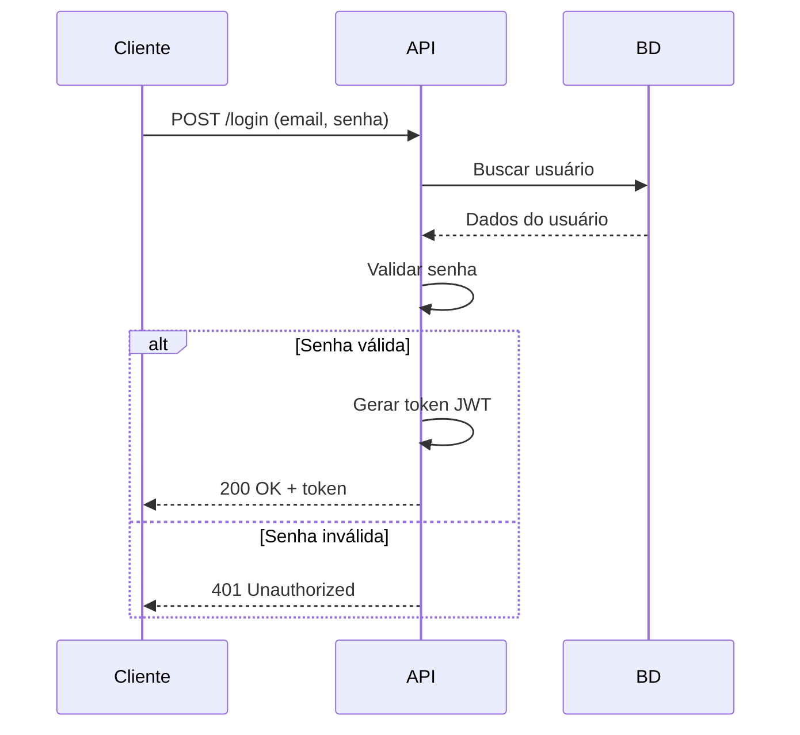
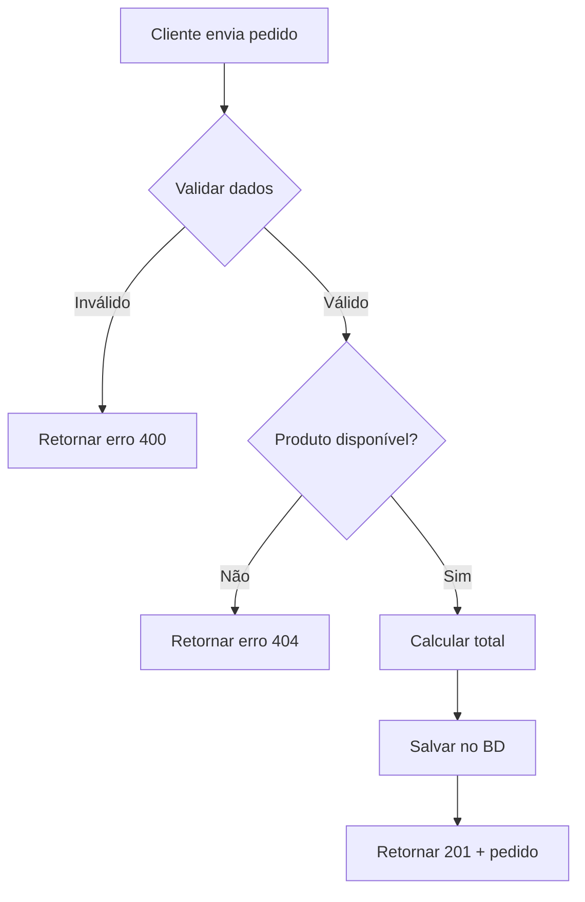

# ✨ Automatiza que Cresce: Projetos Vivos

---

## 🧠 Objetivos de Aprendizagem

Ao final desta aula, você será capaz de:

1. **Compreender a importância dos testes automatizados em APIs:**
   - Explicar o papel dos testes unitários na verificação de endpoints
   - Identificar os benefícios de automatizar testes para garantir a estabilidade do sistema
   - Reconhecer quando e como testar diferentes cenários (sucesso, falha, edge cases)

2. **Implementar testes unitários básicos para endpoints REST:**
   - Utilizar pytest para criar testes de rotas HTTP
   - Escrever testes que validem respostas HTTP, dados retornados e códigos de status
   - Executar e interpretar resultados dos testes automatizados no VSCode

3. **Produzir documentação técnica clara e funcional do projeto:**
   - Criar um arquivo `README.md` profissional contendo descrição, requisitos, instruções de uso e exemplos
   - Documentar endpoints de API de forma acessível para outros desenvolvedores
   - Aplicar princípios de comunicação técnica eficaz

4. **Aplicar boas práticas de versionamento e colaboração com Git/GitHub:**
   - Trabalhar com branches seguindo o modelo Git Flow simplificado
   - Escrever mensagens de commit seguindo Conventional Commits
   - Criar pull requests com descrições claras e contexto adequado

---

## 📋 Conteúdo Programático

### 🧪 Módulo 1: Testes Unitários em APIs (70 minutos)

#### 1.1 Por que testar? O custo do código não testado

**Conceito:**

Testes automatizados são sua rede de segurança. Eles garantem que:

- Novas funcionalidades não quebram código existente
- Bugs são identificados antes de chegarem à produção
- O código pode ser refatorado com confiança
- A documentação "viva" do comportamento esperado existe

**Pirâmide de Testes:**
```
        /\
       /  \  E2E (poucos)
      /____\
     /      \
    / Integr.\  (alguns)
   /__________\
  /            \
 /  Unitários   \  (muitos)
/________________\
```

**Boa prática:** Comece sempre pelos testes unitários — eles são rápidos, baratos e cobrem a maior parte dos cenários.

---

#### 1.2 Configurando o ambiente de testes

**Instalação do pytest:**

```bash
# Instalar pytest e dependências para testar APIs
pip install pytest pytest-cov httpx

# Para APIs Flask
pip install flask pytest

# Para APIs FastAPI
pip install fastapi pytest httpx
```

**Estrutura de diretórios recomendada:**

```source
meu_projeto/
│
├── app/
│   ├── __init__.py
│   ├── main.py          # Aplicação principal
│   └── routes.py        # Endpoints
│
├── tests/
│   ├── __init__.py
│   ├── conftest.py      # Configurações compartilhadas
│   └── test_routes.py   # Testes dos endpoints
│
├── requirements.txt
└── README.md
```

---

#### 1.3 Anatomia de um teste com pytest

**Exemplo básico - Testando uma API Flask:**

```python
# app/main.py
from flask import Flask, jsonify, request

app = Flask(__name__)

usuarios = []

@app.route('/usuarios', methods=['GET'])
def listar_usuarios():
    return jsonify(usuarios), 200

@app.route('/usuarios', methods=['POST'])
def criar_usuario():
    dados = request.get_json()
    
    if not dados or 'nome' not in dados:
        return jsonify({"erro": "Nome é obrigatório"}), 400
    
    usuario = {
        "id": len(usuarios) + 1,
        "nome": dados['nome'],
        "email": dados.get('email', '')
    }
    
    usuarios.append(usuario)
    return jsonify(usuario), 201

@app.route('/usuarios/<int:user_id>', methods=['GET'])
def buscar_usuario(user_id):
    usuario = next((u for u in usuarios if u['id'] == user_id), None)
    
    if not usuario:
        return jsonify({"erro": "Usuário não encontrado"}), 404
    
    return jsonify(usuario), 200

if __name__ == '__main__':
    app.run(debug=True)
```

**Arquivo de testes:**

```python
# tests/conftest.py
import pytest
from app.main import app

@pytest.fixture
def client():
    """Cria um cliente de teste para a aplicação Flask"""
    app.config['TESTING'] = True
    with app.test_client() as client:
        yield client
    
    # Limpeza: resetar lista de usuários após cada teste
    from app.main import usuarios
    usuarios.clear()
```

```python
# tests/test_routes.py
import pytest
import json

def test_listar_usuarios_vazio(client):
    """Testa listagem quando não há usuários cadastrados"""
    response = client.get('/usuarios')
    
    assert response.status_code == 200
    assert response.json == []

def test_criar_usuario_sucesso(client):
    """Testa criação de usuário com dados válidos"""
    novo_usuario = {
        "nome": "Ana Silva",
        "email": "ana@example.com"
    }
    
    response = client.post(
        '/usuarios',
        data=json.dumps(novo_usuario),
        content_type='application/json'
    )
    
    assert response.status_code == 201
    assert response.json['nome'] == "Ana Silva"
    assert response.json['email'] == "ana@example.com"
    assert 'id' in response.json

def test_criar_usuario_sem_nome(client):
    """Testa validação quando nome não é fornecido"""
    usuario_invalido = {"email": "teste@example.com"}
    
    response = client.post(
        '/usuarios',
        data=json.dumps(usuario_invalido),
        content_type='application/json'
    )
    
    assert response.status_code == 400
    assert "erro" in response.json
    assert "obrigatório" in response.json["erro"].lower()

def test_buscar_usuario_existente(client):
    """Testa busca de usuário que existe"""
    # Arrange: criar um usuário primeiro
    novo_usuario = {"nome": "Carlos", "email": "carlos@example.com"}
    response_criacao = client.post(
        '/usuarios',
        data=json.dumps(novo_usuario),
        content_type='application/json'
    )
    user_id = response_criacao.json['id']
    
    # Act: buscar o usuário
    response = client.get(f'/usuarios/{user_id}')
    
    # Assert: verificar resposta
    assert response.status_code == 200
    assert response.json['nome'] == "Carlos"

def test_buscar_usuario_inexistente(client):
    """Testa busca de usuário que não existe"""
    response = client.get('/usuarios/999')
    
    assert response.status_code == 404
    assert "erro" in response.json
```

**Executando os testes no VSCode:**

```bash
# No terminal integrado do VSCode
pytest

# Com informações detalhadas
pytest -v

# Com cobertura de código
pytest --cov=app --cov-report=html

# Executar apenas um arquivo
pytest tests/test_routes.py

# Executar apenas um teste específico
pytest tests/test_routes.py::test_criar_usuario_sucesso
```

---

#### 1.4 Os 3 A's dos testes: Arrange, Act, Assert

**Padrão AAA para organizar testes:**

```python
def test_atualizar_usuario(client):
    # ARRANGE (preparar): configurar o cenário
    usuario = {"nome": "João", "email": "joao@example.com"}
    response = client.post('/usuarios', data=json.dumps(usuario), 
                          content_type='application/json')
    user_id = response.json['id']
    
    # ACT (agir): executar a ação que está sendo testada
    dados_atualizados = {"nome": "João Pedro"}
    response = client.put(
        f'/usuarios/{user_id}',
        data=json.dumps(dados_atualizados),
        content_type='application/json'
    )
    
    # ASSERT (verificar): confirmar o resultado esperado
    assert response.status_code == 200
    assert response.json['nome'] == "João Pedro"
```

**Boas práticas:**

- ✅ Um teste deve verificar uma única funcionalidade
- ✅ Nomes de testes devem descrever o comportamento esperado
- ✅ Testes devem ser independentes entre si
- ✅ Use fixtures para evitar duplicação de código
- ❌ Evite lógica complexa dentro dos testes

---

### 📖 Módulo 2: Documentação Técnica Profissional (50 minutos)

#### 2.1 README.md: O cartão de visitas do seu projeto

**Conceito:**

O README é o primeiro arquivo que qualquer desenvolvedor lê ao encontrar seu projeto. Ele deve responder:

- O que é este projeto?
- Por que ele existe?
- Como usar?
- Como contribuir?

**Estrutura de um README profissional:**

```markdown
# 🚀 Nome do Projeto

> Breve descrição do projeto em uma linha

[](https://www.python.org/)
[](LICENSE)

## 📋 Sobre o Projeto

Descrição mais detalhada sobre o propósito do projeto, problema que resolve,
e contexto de criação.

### ✨ Funcionalidades

- ✅ Cadastro de usuários
- ✅ Autenticação via JWT
- ✅ CRUD completo de produtos
- ✅ Validação de dados
- 🔄 Integração com API externa (em desenvolvimento)

## 🛠️ Tecnologias Utilizadas

- **Python 3.9+**
- **Flask 2.3.0** - Framework web
- **SQLAlchemy** - ORM para banco de dados
- **Pytest** - Framework de testes
- **PostgreSQL** - Banco de dados

## 📦 Instalação

### Pré-requisitos

- Python 3.9 ou superior
- pip (gerenciador de pacotes Python)
- PostgreSQL 12+

### Passo a passo

1. Clone o repositório:
```bash
git clone https://github.com/seu-usuario/seu-projeto.git
cd seu-projeto
```

2. Crie um ambiente virtual:

```bash
python -m venv venv
source venv/bin/activate  # Linux/Mac
venv\Scripts\activate     # Windows
```

3. Instale as dependências:

```bash
pip install -r requirements.txt
```

4. Configure as variáveis de ambiente:

```bash
cp .env.example .env
# Edite o arquivo .env com suas configurações
```

5. Execute as migrações do banco:

```bash
flask db upgrade
```

6. Inicie o servidor:

```bash
python app/main.py
```

A aplicação estará disponível em `http://localhost:5000`

## 🧪 Executando os Testes

```bash
# Todos os testes
pytest

# Com cobertura
pytest --cov=app --cov-report=html

# Testes específicos
pytest tests/test_routes.py
```

## 📚 Documentação da API

### Endpoints disponíveis

#### Usuários

**Listar todos os usuários**

```http
GET /usuarios
```

Resposta (200):

```json
[
  {
    "id": 1,
    "nome": "Ana Silva",
    "email": "ana@example.com"
  }
]
```

**Criar novo usuário**

```http
POST /usuarios
Content-Type: application/json

{
  "nome": "João Pedro",
  "email": "joao@example.com"
}
```

Resposta (201):

```json
{
  "id": 2,
  "nome": "João Pedro",
  "email": "joao@example.com"
}
```

Erros possíveis:

- `400` - Dados inválidos
- `409` - Email já cadastrado

**Buscar usuário por ID**

```http
GET /usuarios/{id}
```

Resposta (200):

```json
{
  "id": 1,
  "nome": "Ana Silva",
  "email": "ana@example.com"
}
```

Erros possíveis:

- `404` - Usuário não encontrado

## 🗂️ Estrutura do Projeto

```source
projeto/
│
├── app/
│   ├── __init__.py
│   ├── main.py           # Ponto de entrada
│   ├── models.py         # Modelos de dados
│   ├── routes.py         # Definição de rotas
│   └── utils.py          # Funções auxiliares
│
├── tests/
│   ├── conftest.py       # Configurações pytest
│   └── test_routes.py    # Testes de endpoints
│
├── .env.example          # Exemplo de variáveis de ambiente
├── .gitignore
├── requirements.txt
└── README.md
```

## 🤝 Como Contribuir

1. Faça um fork do projeto
2. Crie uma branch para sua feature (`git checkout -b feature/MinhaFeature`)
3. Commit suas mudanças (`git commit -m 'feat: adiciona nova funcionalidade'`)
4. Push para a branch (`git push origin feature/MinhaFeature`)
5. Abra um Pull Request

## 📄 Licença

Este projeto está sob a licença MIT. Veja o arquivo [LICENSE](LICENSE) para mais detalhes.

## 👥 Autores

- **Seu Nome** - [@seu-github](https://github.com/seu-usuario)

## 📞 Contato

Dúvidas? Entre em contato: seuemail@example.com

**Dicas:**
- Use emojis com moderação para tornar o README mais visual
- Mantenha instruções claras e testadas
- Inclua exemplos reais de uso
- Atualize o README conforme o projeto evolui

---

#### 2.2 Diagramas de Fluxo: Visualizando a lógica

**Usando Mermaid para criar diagramas no README:**

```markdown
## 🔄 Fluxo de Autenticação



## 📊 Fluxo de Criação de Pedido



**Tipos de diagramas úteis:**
- **Fluxogramas**: Lógica de negócio e decisões
- **Sequência**: Interação entre componentes
- **ER (Entidade-Relacionamento)**: Estrutura do banco de dados
- **Arquitetura**: Visão geral do sistema

---

### 🔀 Módulo 3: Versionamento com Git e GitHub

#### 3.1 Conventional Commits: Padronizando mensagens

**Conceito:**

Conventional Commits é uma convenção para mensagens de commit que facilita:

- Geração automática de changelogs
- Determinação semântica de versões
- Melhor compreensão do histórico

**Estrutura:**

```git
<tipo>[escopo opcional]: <descrição>

[corpo opcional]

[rodapé opcional]
```

**Tipos principais:**

```bash
feat:     # Nova funcionalidade
fix:      # Correção de bug
docs:     # Mudanças na documentação
style:    # Formatação, ponto e vírgula, etc (sem mudança de código)
refactor: # Refatoração sem adicionar feature ou corrigir bug
test:     # Adição ou correção de testes
chore:    # Tarefas de manutenção, atualização de dependências
perf:     # Melhoria de performance
ci:       # Mudanças em CI/CD
build:    # Mudanças no sistema de build
```

**Exemplos práticos:**

```bash
# ✅ Bons exemplos
git commit -m "feat: adiciona endpoint de listagem de produtos"
git commit -m "fix: corrige validação de email no cadastro"
git commit -m "docs: atualiza README com instruções de instalação"
git commit -m "test: adiciona testes para rota de login"
git commit -m "refactor: simplifica lógica de cálculo de frete"

# Com escopo
git commit -m "feat(auth): implementa autenticação JWT"
git commit -m "fix(api): corrige erro 500 ao buscar usuário inexistente"

# Com breaking change
git commit -m "feat!: muda estrutura de resposta da API

BREAKING CHANGE: O campo 'user_id' foi renomeado para 'id'"

# ❌ Evite
git commit -m "ajustes"
git commit -m "corrige bug"
git commit -m "WIP"
git commit -m "Atualização"
```

**Boas práticas:**

- Use o imperativo ("adiciona" em vez de "adicionado")
- Primeira letra minúscula
- Sem ponto final na descrição
- Descrição concisa (máximo 72 caracteres)
- Use o corpo para explicar o "porquê", não o "o que"

---

#### 3.2 Trabalhando com Branches: Git Flow Simplificado

**Estrutura de branches:**

```git
main (produção)
  │
  ├── develop (desenvolvimento)
  │     │
  │     ├── feature/nova-funcionalidade
  │     ├── feature/outro-recurso
  │     │
  │     └── hotfix/correcao-urgente
```

**Fluxo de trabalho:**

```bash
# 1. Criar branch para nova funcionalidade
git checkout develop
git pull origin develop
git checkout -b feature/adicionar-filtros

# 2. Desenvolver e commitar
git add .
git commit -m "feat: adiciona filtro por categoria"
git commit -m "test: adiciona testes para filtros"

# 3. Atualizar com develop antes de enviar
git checkout develop
git pull origin develop
git checkout feature/adicionar-filtros
git rebase develop

# 4. Enviar para o GitHub
git push origin feature/adicionar-filtros

# 5. Criar Pull Request no GitHub

# 6. Após aprovação, fazer merge
git checkout develop
git merge feature/adicionar-filtros
git push origin develop

# 7. Deletar branch local e remota
git branch -d feature/adicionar-filtros
git push origin --delete feature/adicionar-filtros
```

**Nomenclatura de branches:**

```bash
# Features
feature/nome-da-funcionalidade
feature/auth-jwt
feature/filtro-produtos

# Correções
fix/nome-do-bug
fix/erro-validacao-email

# Hotfixes (correções urgentes em produção)
hotfix/nome-correcao-urgente
hotfix/falha-login

# Documentação
docs/atualizar-readme
docs/adicionar-diagramas
```

---

#### 3.3 Pull Requests: Comunicação e Revisão

**Anatomia de um bom Pull Request:**

```markdown
## 📝 Descrição

Implementa sistema de filtros para a listagem de produtos, permitindo
filtrar por categoria, preço e disponibilidade.

## 🎯 Motivação

Closes #42

Os usuários precisam de uma forma mais eficiente de encontrar produtos
específicos na plataforma.

## 🔧 Mudanças Realizadas

- Adiciona endpoint GET /produtos com query parameters
- Implementa filtros por:
  - `categoria` (string)
  - `preco_min` e `preco_max` (float)
  - `disponivel` (boolean)
- Adiciona validação de parâmetros
- Atualiza documentação da API no README

## ✅ Checklist

- [x] Código segue o style guide do projeto
- [x] Testes foram adicionados/atualizados
- [x] Todos os testes passam
- [x] Documentação foi atualizada
- [x] Commits seguem Conventional Commits

## 🧪 Como Testar

```bash
# Instalar dependências
pip install -r requirements.txt

# Executar testes
pytest tests/test_filtros.py

# Testar manualmente
curl "http://localhost:5000/produtos?categoria=eletronicos&preco_max=1000"
```

## 📸 Screenshots (se aplicável)

[Imagens de antes/depois, se relevante]

## 🔗 Issues Relacionadas

- Closes #42
- Related to #38


**Processo de Code Review:**

### ✅ Bom código para review

```python
def calcular_desconto(preco: float, percentual: int) -> float:
    """
    Calcula o preço com desconto aplicado.
    
    Args:
        preco: Preço original do produto
        percentual: Percentual de desconto (0-100)
    
    Returns:
        Preço final com desconto aplicado
    
    Raises:
        ValueError: Se o percentual for inválido
    """
    if not 0 <= percentual <= 100:
        raise ValueError("Percentual deve estar entre 0 e 100")
    
    desconto = preco * (percentual / 100)
    return preco - desconto

# ❌ Código que precisa melhorias
def calc(p, d):
    return p - (p * d / 100)  # Sem validação, sem documentação
```

**Etiqueta de Code Review:**

- Seja respeitoso e construtivo
- Foque no código, não na pessoa
- Explique o "porquê" das sugestões
- Aprove quando estiver satisfeito
- Teste o código localmente quando possível

---

## 🧩 Tópicos Extras Sugeridos

### 1. Introdução a CI/CD: Automatizando Testes com GitHub Actions

**Conceito:**

Integração Contínua (CI) automatiza a execução de testes sempre que há mudanças no código, garantindo que bugs sejam detectados rapidamente.

**Arquivo de configuração básico:**

```yaml
# .github/workflows/tests.yml
name: Testes Automatizados

on:
  push:
    branches: [ main, develop ]
  pull_request:
    branches: [ main, develop ]

jobs:
  test:
    runs-on: ubuntu-latest
    
    steps:
    - uses: actions/checkout@v3
    
    - name: Configurar Python
      uses: actions/setup-python@v4
      with:
        python-version: '3.9'
    
    - name: Instalar dependências
      run: |
        python -m pip install --upgrade pip
        pip install -r requirements.txt
    
    - name: Executar testes
      run: |
        pytest --cov=app --cov-report=xml
    
    - name: Verificar cobertura
      run: |
        coverage report --fail-under=80
```

**Benefícios:**
- Testes executados automaticamente em cada push/PR
- Impede merge de código que quebra testes
- Relatórios de cobertura automáticos
- Integração com badges no README

---

### 2. Badges e Indicadores de Qualidade

**Adicionando badges ao README:**

```markdown

[](https://codecov.io/gh/usuario/projeto)
[](https://www.python.org/)
[](https://github.com/psf/black)
```

**Ferramentas de qualidade:**

- **Black**: Formatação automática de código
- **Flake8**: Linter para verificar estilo
- **mypy**: Verificação de tipos estáticos
- **bandit**: Análise de segurança

## 📚 Materiais e Referências Sugeridas

### 📖 Documentação Oficial

- **Pytest:** https://docs.pytest.org/en/stable/
  - Getting Started: https://docs.pytest.org/en/stable/getting-started.html
  - Fixtures: https://docs.pytest.org/en/stable/fixture.html
  
- **Flask Testing:** https://flask.palletsprojects.com/en/2.3.x/testing/

- **FastAPI Testing:** https://fastapi.tiangolo.com/tutorial/testing/

- **Conventional Commits:** https://www.conventionalcommits.org/en/v1.0.0/

- **GitHub Actions:** https://docs.github.com/en/actions

### 🎥 Vídeos e Tutoriais

- **Como criar README.md completo usando IA (OpenAI):**
  https://www.youtube.com/watch?v=z4aj9TccHIM&t=2s

- **Python Testing with pytest (Playlist):**
  https://www.youtube.com/playlist?list=PLOLrQ9Pn6caxigVJw2jHcQYdkppIuyj6R

- **Qual tipo de teste vale mais a pena?**
  https://www.youtube.com/watch?v=lg6DagRbTnU

- **Git e GitHub para Iniciantes:**
  https://www.youtube.com/watch?v=UBAX-13g8OM

### 📝 Artigos e Guias

- **Writing Good Tests:**
  https://docs.pytest.org/en/stable/goodpractices.html

- **Make a README:**
  https://www.makeareadme.com/

- **GitHub Flow Guide:**
  https://docs.github.com/en/get-started/quickstart/github-flow

- **Mermaid Syntax Reference:**
  https://mermaid.js.org/intro/

### 🛠️ Ferramentas Úteis

- **Shields.io** (gerador de badges):
  https://shields.io/

- **Codecov** (cobertura de código):
  https://codecov.io/

- **readme.so** (editor visual de README):
  https://readme.so/

- **Mermaid Live Editor:**
  https://mermaid.live/

### 📚 Livros Recomendados

- **"Python Testing with pytest" - Brian Okken**
  Guia completo sobre testes em Python

- **"Clean Code" - Robert C. Martin**
  Princípios de código limpo e testável

- **"The Pragmatic Programmer" - David Thomas & Andrew Hunt**
  Boas práticas de desenvolvimento profissional

### 🎓 Cursos Online

- **Real Python - Testing:**
  https://realpython.com/pytest-python-testing/

- **Test-Driven Development with Python:**
  https://www.obeythetestinggoat.com/

---
**🔧 Configuração Recomendada do VSCode:**

Instalem estas extensões:

- **Python** (Microsoft)
- **Python Test Explorer** (Little Fox Team)
- **GitLens** (Eric Amodio)
- **Markdown All in One** (Yu Zhang)
- **Mermaid Preview** (Mathematic Inc.)
- **Better Comments** (Aaron Bond)

---

## 📎 Anexos Úteis

### Cheat Sheet: Comandos Git Essenciais

```bash
# Configuração inicial
git config --global user.name "Seu Nome"
git config --global user.email "seu@email.com"

# Criar repositório
git init
git clone <url>

# Branches
git branch                        # Listar branches
git branch <nome>                # Criar branch
git checkout <nome>              # Mudar para branch
git checkout -b <nome>           # Criar e mudar
git branch -d <nome>             # Deletar branch

# Commits
git status                       # Ver mudanças
git add .                        # Adicionar tudo
git add <arquivo>                # Adicionar específico
git commit -m "mensagem"         # Commitar
git commit --amend               # Corrigir último commit

# Sincronização
git pull origin <branch>         # Baixar mudanças
git push origin <branch>         # Enviar mudanças
git fetch                        # Baixar sem mesclar

# Histórico
git log                          # Ver commits
git log --oneline                # Resumido
git diff                         # Ver diferenças

# Desfazer
git reset HEAD <arquivo>         # Remover do stage
git checkout -- <arquivo>        # Descartar mudanças
git revert <commit>              # Reverter commit
```

### Template: conftest.py para Flask

```python
import pytest
from app.main import app as flask_app

@pytest.fixture
def app():
    """Configura a aplicação Flask para testes"""
    flask_app.config.update({
        "TESTING": True,
        "DATABASE": ":memory:",
    })
    
    # Setup
    yield flask_app
    
    # Teardown
    # Adicione limpeza aqui se necessário

@pytest.fixture
def client(app):
    """Cliente de teste HTTP"""
    return app.test_client()

@pytest.fixture
def runner(app):
    """Runner para comandos CLI"""
    return app.test_cli_runner()
```

### Template: README.md Minimalista

```markdown
# Nome do Projeto

> Descrição curta e direta

## 🚀 Como Usar

```bash
# Instalar
pip install -r requirements.txt

# Executar
python main.py
```

## 📖 Documentação

[Descreva os principais recursos]

## 🧪 Testes

```bash
pytest
```

## 📄 Licença

MIT
```

### Template: .gitignore para Python

```
# Byte-compiled / optimized / DLL files
__pycache__/
*.py[cod]
*$py.class

# Virtual environments
venv/
env/
ENV/

# IDEs
.vscode/
.idea/
*.swp
*.swo

# Testing
.pytest_cache/
.coverage
htmlcov/

# Environment variables
.env
.env.local

# Database
*.db
*.sqlite3

# OS
.DS_Store
Thumbs.db
```

### Checklist: Pull Request

```markdown
## ✅ Checklist antes de criar PR

- [ ] Código foi testado localmente
- [ ] Todos os testes passam (`pytest`)
- [ ] Código segue o style guide do projeto
- [ ] Documentação foi atualizada (se necessário)
- [ ] Commits seguem Conventional Commits
- [ ] Branch está atualizada com develop/main
- [ ] Não há conflitos de merge
- [ ] Código foi revisado por você mesmo
- [ ] Descrição do PR está clara e completa
```

### Exemplo: requirements.txt

```
# Framework Web
flask==2.3.3
flask-cors==4.0.0

# Testes
pytest==7.4.2
pytest-cov==4.1.0
pytest-flask==1.2.0

# Qualidade de código
black==23.9.1
flake8==6.1.0
pylint==2.17.5

# Utilitários
python-dotenv==1.0.0
```
